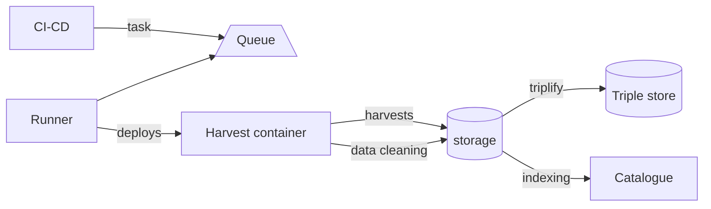
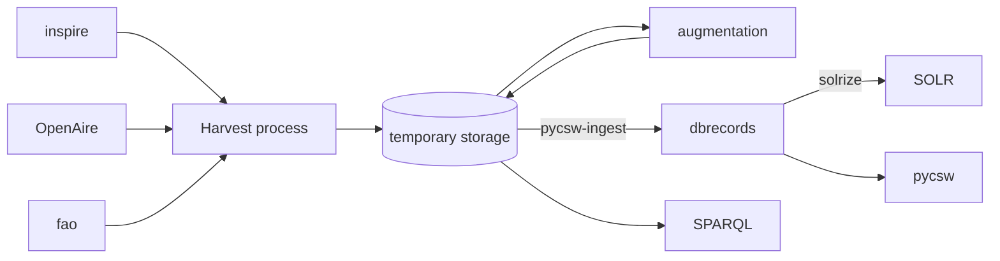

# SWR Harvesters

[](https://doi.org/10.5281/zenodo.14923563)

A component to fetch metadata from remote sources as documented at <https://soilwise-he.github.io/SoilWise-documentation/technical_components/ingestion/>.

Harvesting tasks can best be triggered from a tast runner, such as a CI-CD pipeline. Configuration scripts for running various harvesting tasks in a Gitlab CI-CD environment are available in [CI](./CI/). Tasks are configured using environment variables. The result of the harvester are ingested into a PostGres storage, where follow up processes pick up the results.



This component is tightly related to the [triple store](https://github.com/soilwise-he/triplestore-virtuoso) component and [catalogue component](https://github.com/soilwise-he/pycsw). Harvested records are stored on the triple store as well as the catalogue storage. 

## Harvest in full data flow



The following harvesting tasks are available.

## Fetch records 

- [CSW](./csw) (for example Bonares, EJP Soil, islandr, inspire)
- [ESDAC](./esdac) a dedicated API
- [Cordis/OpenAire](./cordis) combination of SPARQL and API's
- [Prepsoil](./prepsoil/) a dedicated API
- [Newsfeeds](./newsfeeds/) imports newsfeeds from soil mission websites

## Process records

- [iso-triplify](./iso-triplify/) exports iso19139 records to GeoDCAT-AP to be included in SWR triplestore
- [record-to-pycsw](./record-to-pycsw/) exports records to catalogue (as iso19139 or Dublin Core)
- [translate](./translate/) triggers a translation of non english records

## Docker

Run script as docker.
Create a .env file with harvester details.

```
docker build -t soilwise/harvesters .
docker run --env-file csw/.env soilwise/harvesters python csw/metadata.py
```

## Database

Create script for harvest tables

```sql
CREATE SEQUENCE IF NOT EXISTS harvest.sources_source_id_seq
    INCREMENT 1
    START 1
    MINVALUE 1
    MAXVALUE 2147483647
    CACHE 1;

CREATE TABLE IF NOT EXISTS harvest.sources
(
    source_id integer NOT NULL DEFAULT nextval('harvest.sources_source_id_seq'::regclass),
    name character varying(99)  NOT NULL,
    description character varying(255) ,
    url character varying(99) ,
    schedule character varying(99) ,
    type character varying(99) ,
    filter character varying(255) ,
    turtle_prefix text ,
    CONSTRAINT source_pkey PRIMARY KEY (source_id),
    CONSTRAINT source_name_key UNIQUE (name)
)

CREATE TABLE IF NOT EXISTS harvest.items
(
    identifier text  NOT NULL DEFAULT ''::text,
    identifiertype character varying(50) ,
    itemtype character varying(50) ,
    resultobject text  NOT NULL,
    resulttype character varying(50) ,
    uri text  NOT NULL DEFAULT ''::text,
    insert_date timestamp without time zone,
    title text ,
    source text ,
    hash text  NOT NULL DEFAULT ''::text,
    turtle text ,
    date character varying(10) ,
    error text ,
    language character varying(9) ,
    project text ,
    downloadlink text ,
    downloadtype text ,
    CONSTRAINT item_pkey PRIMARY KEY (identifier, uri, hash),
    CONSTRAINT item_sources_name_fkey FOREIGN KEY (source)
        REFERENCES harvest.sources (name) MATCH SIMPLE
        ON UPDATE CASCADE
        ON DELETE NO ACTION
);

CREATE INDEX IF NOT EXISTS ix_items_itemtype
    ON harvest.items USING btree
    (itemtype  ASC NULLS LAST);

CREATE INDEX IF NOT EXISTS ix_items_source
    ON harvest.items USING btree
    (source  ASC NULLS LAST);

CREATE TABLE IF NOT EXISTS harvest.item_duplicates
(
    identifier text  NOT NULL,
    identifiertype character varying(50) ,
    source text  NOT NULL,
    hash text  NOT NULL,
    CONSTRAINT item_duplicates_pkey PRIMARY KEY (identifier, hash),
    CONSTRAINT duplicate_sources_name_fkey FOREIGN KEY (source)
        REFERENCES harvest.sources (name) MATCH SIMPLE
        ON UPDATE CASCADE
        ON DELETE NO ACTION
)
```

