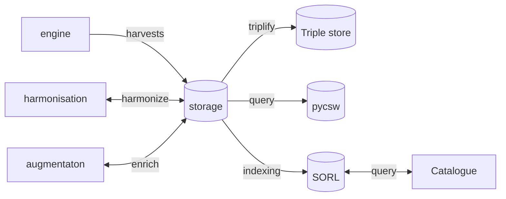

# SoilWise-HE - Harvesting component

[](https://doi.org/10.5281/zenodo.14923563)

A component to ingest metadata from remote sources as documented at <https://soilwise-he.github.io/SoilWise-documentation/technical_components/ingestion/>.

Harvesting tasks can best be triggered from a task runner, such as a CI-CD pipeline. Configuration scripts for running various harvesting tasks in a Gitlab CI-CD environment are available in [CI](./CI/). Tasks are configured using environment variables. The result of the harvester are ingested into a PostGres storage, where follow up processes pick up the results.


``` mermaid
flowchart LR
    hc[engine] -->|harvests| db[(temporary storage)]
    mh[harmonisation] <-->|harmonize| db[(storage)]
    ma[augmentaton]<-->|enrich| db
    db -->|triplify| TS[(Triple store)]
    db -->|query| py[(pycsw)]
    db -->|indexing| SOLR[(SORL)]
    SOLR <-->|query|CT[Catalogue] 
```

This component is tightly related to the [md-harmonization](https://github.com/soilwise-he/md-harmonization) and [md-augmentation](https://github.com/soilwise-he/metadata-augmentation) components. Harvested records are stored on a postgres database. 

## Features
- Ingests metadata from various source types (CSW, Datacite, tailored) 
- Can run as a containerised workflow
- Stores metadata on a PostGres Database

## Installation & Unit tests

Set up the SoilWise PostGres database following the instructions at [db-migrate](https://github.com/soilwise-he/db-migrate). 
Connection details are configured through environment variables, for example as a `.env` file.

```
git clone https://github.com/soilwise-he/harvesters
cd harvesters
pip install -r test/requirements.txt
```

Run unit tests with pytest (from root folder)
```
pytest test
```

## Usage

### Local

From a python enables shell run:

```
python csw/metadata.py
```


### Docker

Run script as docker.
Create a .env file with harvester details.

```
docker build -t soilwise/harvesters .
docker run --env-file csw/.env soilwise/harvesters python csw/metadata.py
```

## Additional information 

The following harvesters are configured:

Generic repositories
- [inspire](#)
- [Bonares repository](#)
- [data.europa.eu](#)
- [OpenAire](#)
- [EEA](./eea) (including copernicus)

Some project specific repositories (while they are running)
- [Prepsoil](./prepsoil/) 
- [Islandr](./CI/islandr)
- [EJP Soil](./CI/ejpsoil)
- [Impact4Soil](./CI/impact4soil)

Alternate harvesters
- [Projects](./projects) are harvested from ESDAC as well as Soil Mission platform
- [Newsfeeds](./newsfeeds/) imports newsfeeds from soil mission websites

---
## Soilwise-he project
This work has been initiated as part of the [Soilwise-he](https://soilwise-he.eu) project. The project receives
funding from the European Union’s HORIZON Innovation Actions 2022 under grant agreement No.
101112838. Views and opinions expressed are however those of the author(s) only and do not necessarily
reflect those of the European Union or Research Executive Agency. Neither the European Union nor the
granting authority can be held responsible for them.

        ON DELETE NO ACTION
);
```
